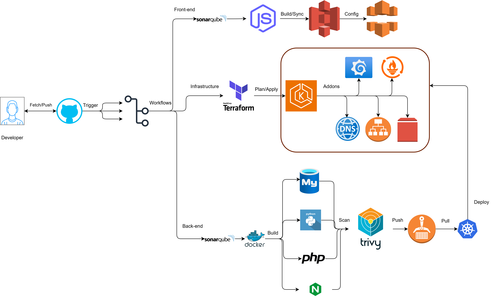

# Coursey

**Coursey** is a web platform designed for real-time learning, where users can access courses and materials instantly and interactively.


## System Overview


## CI/CD Pipeline



This project uses **GitHub Actions** for automated CI/CD with three main workflows:

### Backend Pipeline (`backend.yml`)

| Stage | Description |
|-------|-------------|
| **Detect Changes** | Uses `dorny/paths-filter` to identify which services changed |
| **SonarQube Scan** | Code quality analysis for PHP, Python, Nginx configs |
| **Build & Push** | Builds Docker images only for changed services → ECR |
| **Trivy Scan** | Container vulnerability scanning |
| **Deploy to EKS** | Helm upgrade with dynamic image tags |

**Selective Building:** Only changed services trigger builds. Shared file changes rebuild all.

```
back-end/php/**     → PHP image only
back-end/python/**  → Python image only
back-end/nginx/**   → Nginx image only
back-end/mysql/**   → MySQL image only
.github/workflows/* → ALL images
```

### Frontend Pipeline (`frontend.yml`)

| Stage | Description |
|-------|-------------|
| **SonarQube Scan** | Code quality analysis for React/JS |
| **Build** | `npm run build` with injected API URL |
| **S3 Sync** | Deploy static files to S3 bucket |
| **Invalidate CDN** | CloudFront cache invalidation |

### Infrastructure Pipeline (`IaC.yml`)

| Event | Action |
|-------|--------|
| **Pull Request** | `terraform plan` (preview changes) |
| **Push to main** | `terraform apply` (deploy infrastructure) |

## Prerequisites (Manual Setup Required)


Before deploying, you must manually create the following AWS resources:

### 1. Domain & Route53 Hosted Zone

```bash
# Create a hosted zone for your domain (if not already exists)
aws route53 create-hosted-zone --name example.com --caller-reference $(date +%s)

# Note the Hosted Zone ID from the output (e.g., Z1234567890ABC)
# Update your domain registrar's nameservers to point to Route53
```

### 2. ACM Certificate (SSL/TLS)

```bash
# Request a wildcard certificate for your domain
aws acm request-certificate \
  --domain-name "*.example.com" \
  --subject-alternative-names "example.com" \
  --validation-method DNS \
  --region us-east-1

# Note the CertificateArn from the output!
# Add DNS validation record in Route53, then wait for validation
aws acm describe-certificate --certificate-arn <YOUR_CERT_ARN> --query 'Certificate.Status'
```

### 3. S3 Bucket for Frontend (Private + CloudFront)

```bash
# Create S3 bucket (will be PRIVATE - CloudFront will serve content)
aws s3 mb s3://my-frontend-bucket --region us-east-1

# Block ALL public access (security best practice)
aws s3api put-public-access-block --bucket my-frontend-bucket \
  --public-access-block-configuration "BlockPublicAcls=true,IgnorePublicAcls=true,BlockPublicPolicy=true,RestrictPublicBuckets=true"
```

> **Note:** Do NOT enable static website hosting. S3 is just storage; CloudFront will handle serving.

### 4. CloudFront Distribution with OAC

**Step 1: Create CloudFront Distribution**

1. Go to **AWS Console → CloudFront → Create Distribution**
2. **Origin domain**: Select your S3 bucket from dropdown (e.g., `my-frontend-bucket.s3.us-east-1.amazonaws.com`)
   - ⚠️ Do NOT use the website endpoint URL
3. **Origin access**: Select **Origin access control settings (recommended)**
   - Click **Create control setting** → Use defaults → Create
4. **Viewer protocol policy**: Redirect HTTP to HTTPS
5. **Alternate domain names (CNAMEs)**: Add `www.example.com` (your domain)
6. **Custom SSL certificate**: Select your ACM certificate
7. **Default root object**: `index.html`
8. Click **Create distribution**

**Step 2: Update S3 Bucket Policy**

After creating the distribution, CloudFront shows a banner: "The S3 bucket policy needs to be updated"

1. Click **Copy policy** from the banner
2. Go to **S3 → your bucket → Permissions → Bucket policy → Edit**
3. Paste the policy and **Save**

**Step 3: Configure SPA Routing (Error Pages)**

Since S3 is private, it returns 403 for missing paths. CloudFront must handle this for React/Vue routing:

1. Go to **CloudFront → your distribution → Error pages**
2. Create custom error response:
   - **HTTP error code**: `403: Forbidden`
   - **Customize error response**: Yes
   - **Response page path**: `/index.html`
   - **HTTP response code**: `200: OK`
3. Repeat for **404: Not Found**

**Step 4: Invalidate Cache**

```bash
aws cloudfront create-invalidation --distribution-id YOUR_DISTRIBUTION_ID --paths "/*"
```

Note the **Distribution ID** for GitHub Secrets.

### 5. Terraform State Bucket (Optional but Recommended)

```bash
# Create S3 bucket for Terraform state
aws s3 mb s3://my-terraform-state-bucket --region us-east-1

# Enable versioning
aws s3api put-bucket-versioning --bucket my-terraform-state-bucket --versioning-configuration Status=Enabled
```

### 6. SonarQube Setup (Code Quality)

This monorepo uses **two separate SonarQube projects** - one for backend, one for frontend.

**Step 1: Create SonarCloud Organization**

1. Go to [SonarCloud.io](https://sonarcloud.io) → Sign in with GitHub
2. Create or select your organization (e.g., `my-org`)

**Step 2: Create Projects**

Create **two projects** for this monorepo:

| Project | Key | Name |
|---------|-----|------|
| Backend | `my-org_project-backend` | Project Backend |
| Frontend | `my-org_project-frontend` | Project Frontend |

**Step 3: Generate Tokens**

1. Go to **My Account → Security → Generate Tokens**
2. Create **two tokens**:
   - `SONAR_TOKEN_BACKEND` - for backend analysis
   - `SONAR_TOKEN_FRONTEND` - for frontend analysis

**Step 4: Add to GitHub Secrets**

| Secret | Value |
|--------|-------|
| `SONAR_HOST_URL` | `https://sonarcloud.io` |
| `SONAR_TOKEN_BACKEND` | Token from Step 3 |
| `SONAR_TOKEN_FRONTEND` | Token from Step 3 |

**Step 5: Add GitHub Variable**

| Variable | Value |
|----------|-------|
| `SONAR_ORG` | Your SonarCloud organization (e.g., `my-org`) |

> **Note:** The workflow automatically replaces `YOUR_SONAR_ORG` placeholder in `sonar-*.properties` with your `SONAR_ORG` variable at runtime.

---


## Quick Start

### 1. Initialize Configuration

```bash
# Clone the repository
git clone https://github.com/your-org/Coursey.git
cd Coursey

# Initialize configuration files from templates
make init
```

This creates the following files that you must configure:
- `.env` - Environment variables
- `terraform/terraform.tfvars` - Terraform variables  
- `terraform/backend.hcl` - Terraform state backend
- `helm-charts/coursey-backend/values-local.yaml` - Helm values

### 2. Configure GitHub Repository Variables

Go to your GitHub repository **Settings > Secrets and variables > Variables** and add:

| Variable | Description | Example |
|----------|-------------|---------|
| `AWS_REGION` | AWS region | `us-east-1` |
| `EKS_CLUSTER_NAME` | EKS cluster name | `my-eks-cluster` |
| `ECR_REPO_PREFIX` | ECR repository prefix | `coursey` |
| `S3_BUCKET_NAME` | Frontend S3 bucket (from Prerequisites) | `my-frontend-bucket` |
| `DOMAIN_NAME` | Your domain name | `example.com` |
| `SONAR_ORG` | SonarCloud organization (from Prerequisites Step 6) | `my-org` |
| `TF_STATE_BUCKET` | S3 bucket for Terraform state (from Prerequisites Step 5) | `my-terraform-state-bucket` |
| `TF_STATE_KEY` | Path to save state file inside the bucket | `coursey/terraform.tfstate` |

### 3. Configure GitHub Secrets

Add these secrets in **Settings > Secrets and variables > Secrets**:

| Secret | Description | Source |
|--------|-------------|--------|
| `AWS_ACCESS_KEY_ID` | AWS access key | IAM Console |
| `AWS_SECRET_ACCESS_KEY` | AWS secret key | IAM Console |
| `GRAFANA_PASSWORD` | Grafana admin password | Create a secure password |
| `ACM_CERTIFICATE_ARN` | SSL certificate ARN | From Prerequisites Step 2 |
| `CLOUDFRONT_DISTRIBUTION_ID` | CloudFront ID | From Prerequisites Step 4 |
| `SONAR_HOST_URL` | SonarQube server URL | `https://sonarcloud.io` |
| `SONAR_TOKEN_BACKEND` | SonarQube backend token | SonarCloud → My Account |
| `SONAR_TOKEN_FRONTEND` | SonarQube frontend token | SonarCloud → My Account |

### 4. Deploy Infrastructure (Terraform)

**Step 1: Configure Terraform Variables**

```bash
# Edit terraform.tfvars with your values
nano terraform/terraform.tfvars
```

```hcl
# terraform/terraform.tfvars
cluster_name   = "my-eks-cluster"
region         = "us-east-1"
domain_name    = "example.com"
hosted_zone_id = "Z1234567890ABC"  # From Route53
```

**Step 2: Configure Terraform Backend (Optional)**

```bash
# Edit backend.hcl for remote state
nano terraform/backend.hcl
```

```hcl
# terraform/backend.hcl
bucket = "my-terraform-state-bucket"
key    = "coursey/terraform.tfstate"
region = "us-east-1"
```

**Step 3: Deploy with Terraform**

```bash
# Set Grafana password (required)
export TF_VAR_grafana_password="your-secure-password"

# Initialize Terraform
make terraform-init
# Or: cd terraform && terraform init -backend-config=backend.hcl

# Preview changes
make terraform-plan

# Apply infrastructure
make terraform-apply
```

**What Terraform Creates:**
| Resource | Description |
|----------|-------------|
| VPC | Private networking with public/private subnets |
| EKS Cluster | Kubernetes control plane |
| Node Group | Worker nodes (m7i-flex.large) |
| ECR | Container registries for images |
| ALB Controller | AWS Load Balancer for ingress |
| External DNS | Automatic Route53 DNS management |
| Prometheus + Grafana | Monitoring stack |
| CloudWatch Logging | Fluent Bit → CloudWatch → S3 archival |

**Step 4: Get Cluster Access**

```bash
# Update kubeconfig
make kubeconfig
# Or: aws eks update-kubeconfig --name my-eks-cluster --region us-east-1

# Verify access
kubectl get nodes
```


### 5. Deploy via Makefile (CLI)

> ⚠️ **IMPORTANT:** Before using Makefile commands, you MUST edit **ALL configuration files** with your actual values!

**Step 1: Configure All Environment Files**

After running `make init`, edit the following files:

```bash
# Required files to configure:
nano .env                                        # AWS & project settings
nano terraform/terraform.tfvars                  # Terraform variables
nano terraform/backend.hcl                       # Remote state config
nano helm-charts/coursey-backend/values-local.yaml  # Helm overrides
```

**`.env` - Critical values to update:**
```bash
AWS_REGION=us-east-1
AWS_ACCOUNT_ID=087736691889          # ⚠️ YOUR AWS Account ID
EKS_CLUSTER_NAME=coursey-eks-cluster # ⚠️ YOUR cluster name
ECR_REPO_PREFIX=coursey              # ⚠️ YOUR ECR prefix
DOMAIN_NAME=example.com              # ⚠️ YOUR domain
```

**Step 2: Build & Push Docker Images**

```bash
# Build all service images locally
make docker-build

# Login to ECR and push images
make docker-push
```

**Step 3: Deploy Application with Helm**

```bash
# Update kubeconfig for your cluster
make kubeconfig

# Verify cluster access
make pods  # Should show running pods (or empty if first deploy)

# Deploy application
make helm-deploy
```

**Complete Makefile Deployment Flow:**

```
┌─────────────────────────────────────────────────────────────────┐
│  1. make init          → Create config files from templates     │
│  2. Edit .env files    → Configure YOUR actual values           │
│  3. make validate      → Verify all configs exist               │
├─────────────────────────────────────────────────────────────────┤
│  4. make terraform-init   → Initialize Terraform                │
│  5. make terraform-plan   → Preview infrastructure changes      │
│  6. make terraform-apply  → Deploy AWS infrastructure           │
├─────────────────────────────────────────────────────────────────┤
│  7. make docker-build  → Build PHP, Nginx, MySQL, Python images │
│  8. make ecr-login     → Authenticate with ECR                  │
│  9. make docker-push   → Push images to ECR                     │
├─────────────────────────────────────────────────────────────────┤
│  10. make kubeconfig   → Configure kubectl for EKS              │
│  11. make helm-deploy  → Deploy app to Kubernetes               │
│  12. make pods         → Verify pods are running                │
└─────────────────────────────────────────────────────────────────┘
```

### 6. Alternative: Direct Helm Deploy (Without Makefile)

If you prefer to deploy directly without Makefile, use Helm with `--set` flags:

```bash
# Update kubeconfig
aws eks update-kubeconfig --name my-eks-cluster --region us-east-1

# Deploy with your values
helm upgrade --install coursey ./helm-charts/coursey-backend/ \
  --namespace default \
  --set ingress.alb.certificateArn="arn:aws:acm:us-east-1:123456789:certificate/your-cert-id" \
  --set secrets.hostName="example.com" \
  --set appConfig.apiBaseUrl="https://api.example.com" \
  --set "ingress.hosts[0].host=api.example.com" \
  --set "ingress.hosts[1].host=admin.example.com" \
  --set php.image.repository="123456789.dkr.ecr.us-east-1.amazonaws.com/coursey/php" \
  --set nginx.image.repository="123456789.dkr.ecr.us-east-1.amazonaws.com/coursey/nginx" \
  --set mysql.image.repository="123456789.dkr.ecr.us-east-1.amazonaws.com/coursey/mysql" \
  --set python.image.repository="123456789.dkr.ecr.us-east-1.amazonaws.com/coursey/python" \
  --timeout 5m \
  --wait
```

**Key values to replace:**
| Placeholder | Your Value |
|-------------|------------|
| `arn:aws:acm:...` | Your ACM Certificate ARN |
| `example.com` | Your domain name |
| `123456789` | Your AWS Account ID |
| `us-east-1` | Your AWS Region |


## Local Development


### Frontend

```bash
cd front-end
npm install
npm start
# Access at http://localhost:3000
```

### Backend

```bash
cd back-end
cp .env.example .env   # Edit .env with your database credentials
docker compose up --build
# API at http://localhost:8080, Admin at http://localhost:8082
```

### Database Setup

```bash
docker exec -i back-end-db-1 mysql -u root -p$MYSQL_ROOT_PASSWORD $MYSQL_DATABASE < back-end/sql/docker-php_export.sql
```

> **Note:** Default credentials are configured in your local `.env` file. Never commit actual credentials to version control.

## Available Commands

Run `make help` to see all available commands:

```
Coursey DevOps Commands
========================

Setup:
  make init              - Initialize project (copy example config files)
  make validate          - Validate configuration files exist

Terraform:
  make terraform-init    - Initialize Terraform with backend config
  make terraform-plan    - Run Terraform plan
  make terraform-apply   - Apply Terraform changes
  make terraform-destroy - Destroy infrastructure

Helm:
  make helm-deploy       - Deploy application via Helm
  make helm-uninstall    - Uninstall Helm release

Cleanup:
  make clean             - Clean up local Terraform files
```

## Contributing

We welcome contributions to Coursey. Please submit a pull request with your changes.

## License

Coursey is licensed under the [MIT License](https://opensource.org/licenses/MIT).

