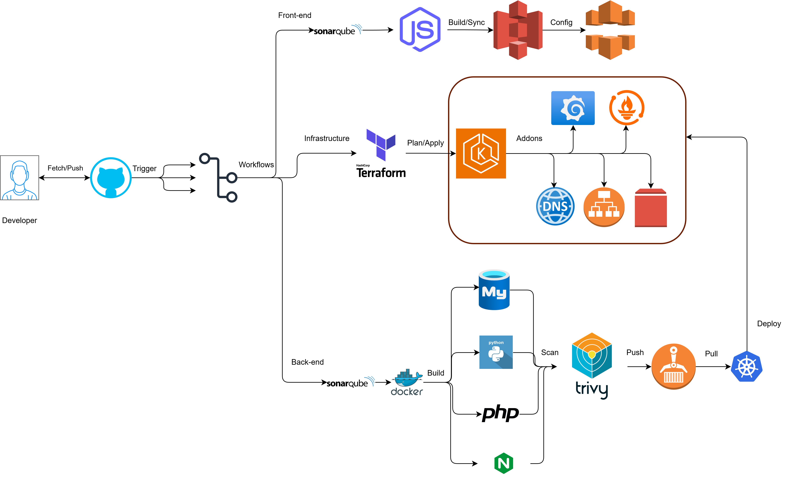

# Coursey - Real-Time Learning Platform

**Coursey** is a modern web platform designed for real-time learning. It enables users to browse, access, and interact with courses and educational materials instantly and interactively.

## 📌 Project Overview

This repository contains the source code and Infrastructure as Code (IaC) configurations for deploying the entire Coursey ecosystem. The project is designed with a microservices-oriented backend, a modern frontend, and a fully automated deployment lifecycle targetting self-hosted/cloud-native environments using Kubernetes.

## 🛠️ Technology Stack & Architecture

The project leverages a robust and modern technology stack to ensure scalability, maintainability, and high availability.

### 🌐 Frontend (Web App)
- **Framework:** React.js / SCSS
- **Hosting:** Amazon S3 & CloudFront (CDN)

### ⚙️ Backend (Microservices Core)
- **API Gateway / Proxy:** Nginx (Routing requests)
- **Core Services:** PHP (Primary Business Logic)
- **Data Science/AI Services:** Python (FastAPI/Flask)
- **Database:** MySQL (Relational Data Storage)

### ☁️ Infrastructure & Orchestration
- **Cloud Provider:** Amazon Web Services (AWS)
- **Containerization:** Docker & Amazon Elastic Container Registry (ECR)
- **Orchestration:** Kubernetes (Amazon EKS)
- **Infrastructure as Code (IaC):** Terraform
- **Package Management:** Helm Charts

### 🔍 Monitoring & Security
- **Monitoring & Observability:** Prometheus & Grafana
- **Log Management:** Fluent Bit & Amazon CloudWatch
- **Code Quality:** SonarQube (Static Analysis)
- **Vulnerability Scanning:** Trivy (Container Security)

## 🚀 Automated CI/CD Pipelines

The project utilizes **GitHub Actions** to fully automate integration and delivery across three distinct pipelines:

1. **Backend Pipeline (`backend.yml`)**
   - Implements intelligent path filtering (only rebuilds changed services).
   - Runs SonarQube code quality scans.
   - Builds Docker images via Buildx caching and scans them with Trivy.
   - Pushes artifacts to AWS ECR.
   - Automatically upgrades the deployment via Helm to the EKS cluster.

2. **Frontend Pipeline (`frontend.yml`)**
   - Runs SonarQube analysis for React code.
   - Builds the optimized static bundle.
   - Syncs static assets to a private S3 bucket.
   - Invalidates the CloudFront CDN cache for immediate global updates.

3. **Infrastructure Pipeline (`IaC.yml`)**
   - Automatically provisions and updates AWS resources (VPC, Subnets, EKS, ALB Controller, ExternalDNS, Logs) using Terraform.
   - Enforces infrastructure changes safely via `terraform plan` on PRs and `terraform apply` on main branch merges.

---

## 📖 Deployment & Contribution Guide

For full, step-by-step instructions on deploying the infrastructure, setting up local development, and tearing down the environment, please refer to the **deployment instruction PDF document** provided alongside this repository.

### License
Coursey is licensed under the [MIT License](https://opensource.org/licenses/MIT).
